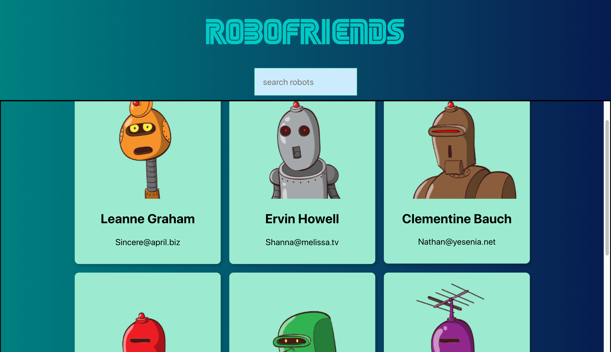
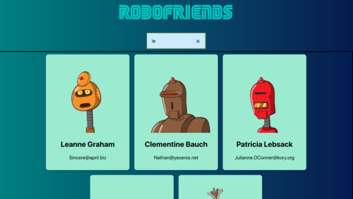

<h1>ROBOFRIENDS</h1>
<h2>Simple React App</h2>
https://sterap.github.io/robofriends/

<h2>Explanation</h2>
ROBOFRIENDS is a small and simple React App which I developed in order to start practicing with React and API. The app is built on the API provided by Robohash https://robohash.org. 
The app includes a searching feature that allows users to filter among their robofriends by typing the robots' names. 

